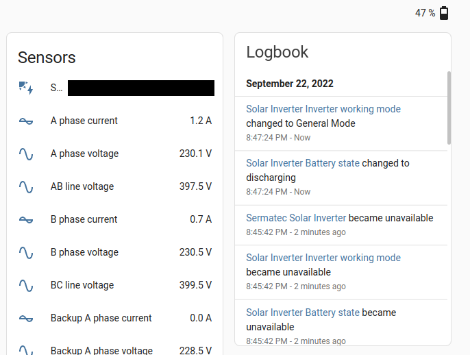

**NOTICE: Due to my limited time (school, work, research projects), I am not currently actively maintaining this integration (pull requests are always welcome). The communication script needs still some work to do, so I will update this integration after the script is finished.**

# Sermatec Inverter for Home Assistant



## Installation
### Manual
1. Download integration.
2. Copy the folder `custom_components/sermatec_inverter` to your config directory.
3. Restart Home Assistant.
4. In Home Assistant, go to Settings -> Devices & Services -> `+ ADD INTEGRATION` -> search for Sermatec Inverter -> fill in host and port -> click submit.
5. Done! Now you can see all the sensors in Integrations under Sermatec Inverter.

Notes:
- IP is probably assigned dynamically by your router's DHCP server. I recommend setting a static IP (available on most routers), otherwise you would probably need to change the IP in the config once in a while.
- The default port is `8899`.

## Tips
### Calculating total energy
To use this integration with Energy Dashboard or to calculate energy usage/import/export etc. you need to use the [Riemann sum integration](https://www.home-assistant.io/integrations/integration/). You can use a new GUI setup in a Helpers category (which is recommended), or an old yaml config method, example is below. Do not forget to set:
- metric prefix (unit_prefix) to `k` and integration time (unit_time) to `h` (hours) to get values in `kWh` - important to be able to use these in the Energy dashboard!
- integral method (method) to `left`, otherwise there will be **very** inaccurate results!

```
sensor:
  - platform: integration
    source: sensor.solar_inverter_grid_export
    name: Grid export
    unique_id: sermatec_energy_grid_export
    unit_prefix: k
    round: 2
    method: left
  - platform: integration
    source: sensor.solar_inverter_grid_import
    name: Grid import
    unique_id: sermatec_energy_grid_import
    unit_prefix: k
    round: 2
    method: left
  - platform: integration
    source: sensor.solar_inverter_pv_total_power
    name: PV total energy
    unique_id: sermatec_energy_pv_total
    unit_prefix: k
    round: 2
    method: left
  - platform: integration
    source: sensor.solar_inverter_pv1_power
    name: PV1 energy
    unique_id: sermatec_energy_pv1
    unit_prefix: k
    round: 2
    method: left
  - platform: integration
    source: sensor.solar_inverter_pv2_power
    name: PV2 energy
    unique_id: sermatec_energy_pv2
    unit_prefix: k
    round: 2
    method: left
  - platform: integration
    source: sensor.solar_inverter_battery_charging_power
    name: Battery charging energy
    unique_id: sermatec_energy_battery_charging
    unit_prefix: k
    round: 2
    method: left
  - platform: integration
    source: sensor.solar_inverter_battery_discharging_power
    name: Battery discharging energy
    unique_id: sermatec_energy_battery_discharging
    unit_prefix: k
    round: 2
    method: left
``` 

### Daily, weekly or monthly consumption
To track consumption per specified time interval you can use [Utility Meter](https://www.home-assistant.io/integrations/utility_meter/).

## Supported devices
Only tested device is the `Sermatec SMT-10K-TL-TH`. However, probably all residential hybrid inverters by Sermatec should work.

## Communication script
Inverter communication script is in development in [this repository](https://github.com/andreondra/sermatec-inverter), which includes also a detailed documentation.

## Disclaimer
Because the protocol used for local communication is reverse-engineered (due to the lack of the official documentation), I am not responsible for any damage that this integration could cause to your inverter or to your house wiring / electrical equipment.
