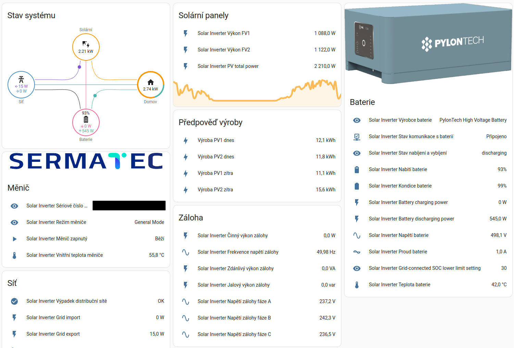

# Sermatec Inverter for Home Assistant



## Introduction
This integration adds support for solar inverters by Chinese manufacturer Shangai Sermatec Energy Technology to the Home Assistant. Currectly the integration supports reading all basic data, including PV, battery and grid status. Entity friendly names language is selectable during integration configuration.

### Supported languages:
- 🇺🇸 English
- 🇨🇿 čeština
- 🇫🇷 Français
- <span dir="ltr"> اَلْعَرَبِيَّةُ </span>
- Missing any language? Check out [this issue](https://github.com/sermatec-opensource/sermatec-inverter/issues/62) and contribute with translations!

### Supported models:
- `Sermatec SMT-10K-TL-TH`
- *Probably all residential hybrid inverters by Sermatec should work: all of 5, 6 and 10 kW versions.*

### Supported PCU versions:
- all versions, newest tested is 6.1.9

## Installation
**IMPORTANT NOTICE FOR USERS OF LEGACY VERSIONS (pre v2.0.0)**: The new version of the integration is not backwards-compatible. This means you will need to manually remove the device from your Home Assistant and then add again.

### Manual installation
1. Download integration.
    - Latest development version can be downloaded [from Releases as a zip](https://github.com/sermatec-opensource/homeassistant-sermatec-inverter/releases/download/latest/sermatec_inverter.zip).
2. Unzip the downloaded zip file to your Home Assistant configuration directory.
3. Restart Home Assistant.
4. In Home Assistant, go to Settings -> Devices & Services -> `+ ADD INTEGRATION` -> search for Sermatec Inverter -> fill in host, port and select language -> click submit.
5. Done! Now you can see all the sensors in Integrations under Sermatec Inverter.

Notes:
- IP is probably assigned dynamically by your router's DHCP server. I recommend setting a static IP (available on most routers), otherwise you would probably need to change the IP in the config once in a while.
- The default port is `8899`.

### Using legacy version
If for some reason you need to use the legacy version which utilized the first version of the communication script, it is still available for downloaded [in Releases](https://github.com/sermatec-opensource/homeassistant-sermatec-inverter/releases/tag/v1.0.1).

## Usage & Tips
### Setting parameters (using switches, selects...)
- When setting parameters using this integration (for example turning the inverter off using the switch), there will be slight delay until the parameter updates. For example: if you turn off the inverter, the switch may stay on for up to 1 minute until new data are fetched from the inverter -- this is expected and not an error. This is caused by the communication protocol itself and is unavoidable for now.
- Parameters can't be set immediately after the integration is loaded. Please wait for about 1 minute -- initialization data need to be loaded from the inverter.
- Some paramaters require that the inverter is turned off before setting the parameter (e.g. the backflow protection function). Before setting these parameters, use the "Power" switch to turn the inverter off. Full list of these parameters can be found in the comm script repo [here](https://github.com/sermatec-opensource/sermatec-inverter).

### Calculating total energy
To use this integration with Energy Dashboard or to calculate energy usage/import/export etc. you need to use the [Riemann sum integration](https://www.home-assistant.io/integrations/integration/). You can use a new GUI setup in a Helpers category (which is recommended), or an old yaml config method, example is below. Do not forget to set:
- metric prefix (unit_prefix) to `k` and integration time (unit_time) to `h` (hours) to get values in `kWh` - important to be able to use these in the Energy dashboard!
- integral method (method) to `left`, otherwise there will be **very** inaccurate results!

```
sensor:
  - platform: integration
    source: sensor.solar_inverter_grid_export
    name: Grid export
    unique_id: sermatec_energy_grid_export
    unit_prefix: k
    round: 2
    method: left
  - platform: integration
    source: sensor.solar_inverter_grid_import
    name: Grid import
    unique_id: sermatec_energy_grid_import
    unit_prefix: k
    round: 2
    method: left
  - platform: integration
    source: sensor.solar_inverter_pv_total_power
    name: PV total energy
    unique_id: sermatec_energy_pv_total
    unit_prefix: k
    round: 2
    method: left
  - platform: integration
    source: sensor.solar_inverter_pv1_power
    name: PV1 energy
    unique_id: sermatec_energy_pv1
    unit_prefix: k
    round: 2
    method: left
  - platform: integration
    source: sensor.solar_inverter_pv2_power
    name: PV2 energy
    unique_id: sermatec_energy_pv2
    unit_prefix: k
    round: 2
    method: left
  - platform: integration
    source: sensor.solar_inverter_battery_charging_power
    name: Battery charging energy
    unique_id: sermatec_energy_battery_charging
    unit_prefix: k
    round: 2
    method: left
  - platform: integration
    source: sensor.solar_inverter_battery_discharging_power
    name: Battery discharging energy
    unique_id: sermatec_energy_battery_discharging
    unit_prefix: k
    round: 2
    method: left
``` 

### Daily, weekly or monthly consumption
To track consumption per specified time interval you can use [Utility Meter](https://www.home-assistant.io/integrations/utility_meter/).

## Troubleshooting or missing features
If you have trouble with setting up the integration, data retrieval or see some exceptions in the logs, you can open an issue. Please include your inverter model and PCU version if possible.

If you miss any feature, you may try opening the issue as well. But at first, have a look at other issues or milestones, maybe the feature is already in development.

## Communication script
Inverter communication script is in development in [this repository](https://github.com/andreondra/sermatec-inverter), which includes also a detailed documentation.

## Disclaimer
Because the protocol used for local communication is reverse-engineered (due to the lack of the official documentation), I am not responsible for any damage that this integration could cause to your inverter or to your house wiring / electrical equipment. Use at your own risk. You can also lose warranty, some distributors are known to not like using unofficial ways of interfacing with the inverter.

## Credits
The project is licensed under the MIT License. (C) Ondrej Golasowski and contributors. Special thanks go to everybody who helped to test and verify this integration or provided any manuals or documentations.